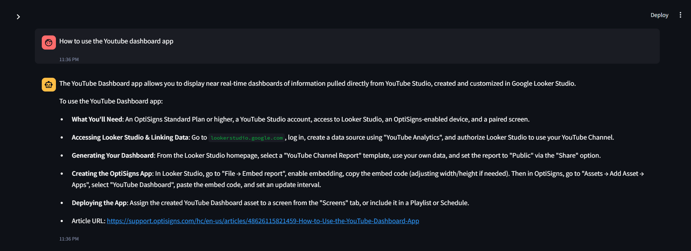
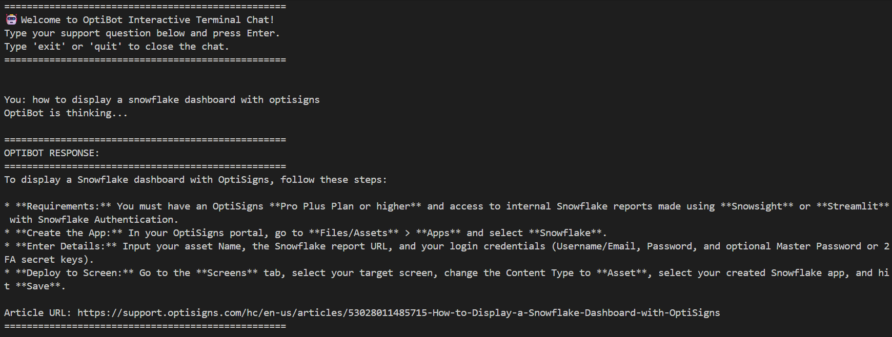
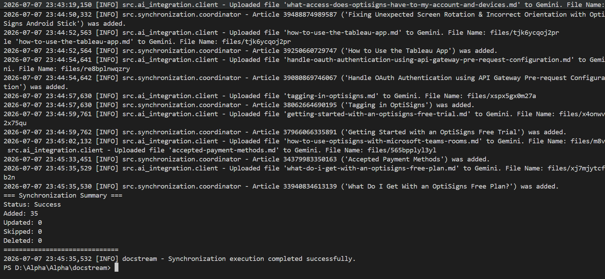

# DocStream: OptiSigns support article scraper and Gemini-grounded Support Assistant

A lightweight Python system that crawls and normalizes Zendesk support articles into Markdown, runs delta-sync state tracking, programmatically uploads content to Google Gemini API (Free Tier), and runs a local Streamlit Chatbot UI for validation.

---

## 🛠️ Setup & Local Installation

### 1. Configure Credentials
Create a `.env` file in the project root:
```env
AI_API_KEY="your-gemini-api-key"
HELP_CENTER_API_URL="https://support.optisigns.com/api/v2/help_center"
HELP_CENTER_PAGE_URL="https://support.optisigns.com"
```

### 2. Install Dependencies
```bash
py -m pip install -r requirements.txt
```

---

## 🧠 Chunking & Embedding Strategy

*   **Strategy:** *1-to-1 Document Grounding (Whole-Document Semantic Chunking)*
*   **Rationale:** Since support articles on Zendesk are naturally short (average 300–800 words) and highly focused on a single topic, we treat **each clean Markdown article as a single cohesive semantic chunk**.
*   **Gemini Context Advantage:** By leveraging Google Gemini's massive context window (1M+ tokens), uploading whole files via the Files API preserves 100% of the document's structure (like complete step-by-step guides, lists, and tables) without losing vital context at arbitrary token boundaries (which occurs in fixed-size token chunking).
*   **Metrics:** The synchronization summary logs the count of synchronized files, where each file maps directly to a high-fidelity document chunk:
    *   `Files Uploaded/Updated: X` (equivalent to X semantic document chunks embedded).

---

## 🚀 Running the Project Locally

### Step 1: Run Ingestion & Delta Sync
Scrape articles, clean to Markdown, and upload to Google Gemini Vector Store:
```bash
py -m src.main
```
*   **API Mode:** Fetches articles via Zendesk API.
*   **Crawler Fallback:** BS4 crawls HTML page directly if API is blocked.
*   **Delta Checks:** Re-running only uploads `added` or `updated` documents.

### Step 2: Start Chat Interface (Web UI or Terminal CLI)
You can test the grounding assistant in two ways:

#### Option A: Web User Interface (Streamlit)
```bash
py -m streamlit run src/app.py
```
Open **`http://localhost:8501`** to chat with OptiBot. You can select model types (like `gemini-1.5-flash-latest` or `gemini-2.0-flash`) in the sidebar to bypass overload errors.

#### Option B: Interactive Terminal (CLI Mode)
```bash
py -m src.test_chat
```
This launches a text-based chat session directly in your terminal. Type your question and press Enter. Type `exit` or `quit` to end the session.

---

## 🐳 Docker Setup
To build and run the daily sync job as a container:

```bash
# Build the Docker image
docker build -t docstream-sync-job .

# Run container (runs one sync cycle, exits with code 0)
docker run --env-file .env docstream-sync-job
```

---

## ☁️ Daily Job Deployment (Railway / Render)

You can easily schedule the Docker container on **Railway** or **Render**:

### Railway Deploy Steps:
1. Create a new project on Railway and link your Github Repo.
2. Select **Add Service** -> Choose the Repository -> Select **Cron Job**.
3. Set Cron Schedule to `0 0 * * *` (Runs daily at midnight).
4. Go to **Variables** and add:
   * `AI_API_KEY`: your Gemini API key.
   * `HELP_CENTER_API_URL`: `https://support.optisigns.com/api/v2/help_center`
5. Railway will automatically build using the `Dockerfile` and run the script daily.

---

## 📸 Verification Screenshots

### 1. Grounded Chatbot (Streamlit Web UI)


### 2. Interactive Terminal Chat (CLI Mode)


### 3. Delta Sync Console Log

